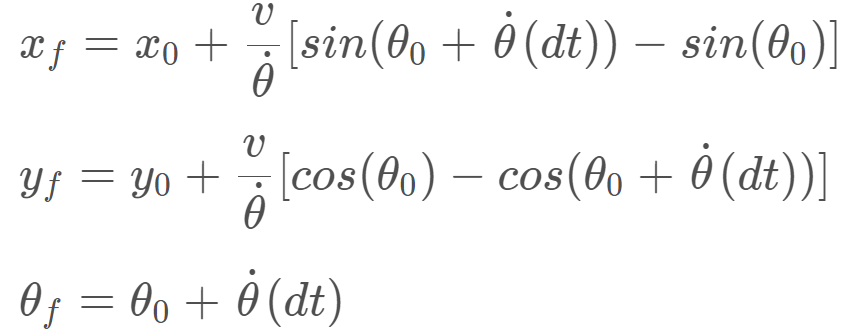

# Kidnapped Vehicle Project

Assuming that a robot has been kidnapped and transported to a new location! Luckily it has a map of this location, a (noisy) GPS 
estimate of its initial location, and lots of (noisy) sensor and control data. <br>
In this project, I implemented a 2D particle filter in C++. The particle filter was given a map and 
some initial localization information (analogous to what a GPS would provide). <br>
At each time step the filter also got observation and control data.

---

## Demostration


The full demos are available at [https://youtu.be/oEYFJUF8AYY](https://youtu.be/oEYFJUF8AYY)

## Particle Filters Implementation

The Particle Filters flowchart:


Particle filters algorithm consists of four main steps:
1. **Initialisation step**: At the initialization step I estimated the car's position based on the GPS input. The subsequent steps in the 
process will refine this estimate to localize our vehicle. I set `num_particles` to 1000 (the value could be changed in line #37
in file `src/particle_filter.cpp`).
2. **Prediction step**: During the prediction step I added the control input (yaw rate & velocity) for all particles.<br>
The equations for updating x, y and the yaw angle when the yaw rate is not equal to zero:


3. **Update step**: During the update step, I updated our particle weights using map landmark positions and feature measurements. <br>   
There are three sub-steps in the update step:
    - **_Transformation_**: Transforming the car’s measurements from its local car coordinate system to the map’s coordinate system.
    - **_Association_**: Matching landmark measurement to object in the map landmarks (Finding nearest neighbor)
    - **_Update Weights_**: Calculating the product of each measurement’s Multivariate-Gaussian probability density.
4. **Resample step**: During resampling I resampled `num_particles` times drawing a particle i 
(i is the particle index) proportional to its weight . Resampling wheel method was used at this step.

The Particle Filters pseudo code:


## Source code structure
The directory structure of this repository is as follows:

```shell script
${ROOT}
├──build.sh
├──clean.sh
├──CMakeLists.txt
├──README.md
├──run.sh
├──data/
    ├──map_data.txt
├──src/
    ├──helper_functions.h
    ├──main.cpp
    ├──map.h
    ├──particle_filter.cpp
    ├──particle_filter.h
```


## How to compile and run
1. Download the Term 2 Simulator [here](https://github.com/udacity/self-driving-car-sim/releases).
2. Install `uWebSocketIO`: <br>
This repository includes two files that can be used to set up and install [uWebSocketIO](https://github.com/uWebSockets/uWebSockets) 
for either Linux or Mac systems. For windows you can use either Docker, VMware, 
or even [Windows 10 Bash on Ubuntu](https://www.howtogeek.com/249966/how-to-install-and-use-the-linux-bash-shell-on-windows-10/)<br>
You can execute the `install-ubuntu.sh` to install uWebSocketIO.

3. Once the install for uWebSocketIO is complete, the main program can be built and ran by doing the following from the project top directory.

```shell script
mkdir build
cd build
cmake ..
make
./particle_filter
```
   
Alternatively some scripts have been included to streamline this process, these can be leveraged by executing the 
following in the top directory of the project:

```shell script
./clean.sh
./build.sh
./run.sh
```
    
## Input & Output data notes

### The Map*
`map_data.txt` includes the position of landmarks (in meters) on an arbitrary Cartesian coordinate system. Each row has three columns
- *x* position
- *y* position
- landmark *id*

### INPUT 
Input values provided by the simulator to the C++ program

- Sense noisy position data from the simulator: *"sense_x", "sense_y", "sense_theta"*

- Get the previous velocity and yaw rate to predict the particle's transitioned state: *"previous_velocity", "previous_yawrate"*

- Receive noisy observation data from the simulator, in a respective list of x/y values: *"sense_observations_x", "sense_observations_y"*

### OUTPUT
Output values provided by the C++ program to the simulator

- Best particle values used for calculating the error evaluation: *"best_particle_x", "best_particle_y", "best_particle_theta"*

- Optional message data used for debugging particle's sensing and associations for respective (x,y) sensed positions ID label

    - *"best_particle_associations"*: for respective (x,y) sensed positions

    - *"best_particle_sense_x"*: list of sensed x positions

    - *"best_particle_sense_y"*: list of sensed y positions


## Success Criteria
1. **Accuracy**: The particle filter should localize vehicle position and yaw to within the values specified in the 
parameters `max_translation_error` and `max_yaw_error`

2. **Performance**: The particle filter should complete execution within the time of 100 seconds.

Finally, the simulator output says:

```
Success! Your particle filter passed!
```